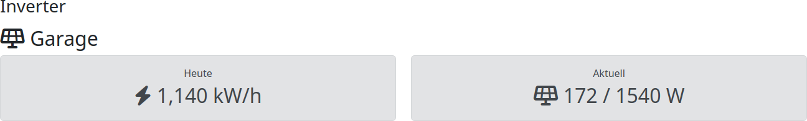
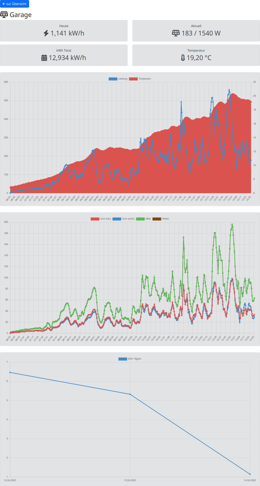

Die Daten aus der [openDTU](https://github.com/tbnobody/OpenDTU) müssen jetzt in die Datenbank. Dafür gibt es die `import.php`.  
Die erste Möglichkeit ist es, die `import.php` mit dem GET Parameter ip=\[DTU-IP\] aufzurufen:

`import.php?ip=192.168.x.x`

Die zweite Möglichkeit ist, auf einem Server innerhalb des Netzwerkes ein kleines Shell-/Batch-Script laufen zu lassen.

_data.sh_

    #!/bin/bash
    while true; do
        wget http://192.168.x.x/api/livedata/status -O data.json
        wget --post-file=data.json import.php -O result.txt
        sleep 5
    done

_data.bat_

    :start
    wget http://192.168.x.x/api/livedata/status -O data.json
    wget --post-file=data.json import.php -O result.txt
    timeout /t 5 /nobreak
    goto start

Dabei werden die JSON-Daten aus der openDTU zwischengespeichert und anschließend via POST an die `import.php` gesendet.

_Übrigens:_  
Die Namen der Inverter/Strings werden aus der openDTU übernommen und auch in den Charts verwendet.  
Es können auch mehrere openDTUs in die gleiche Datenbank eingespielt werden.

**Zum Schluss:**  
Lösche dieses Script `install.php` zur Sicherheit bitte aus dem Hauptverzeichniss.

Übersicht:

Details:
